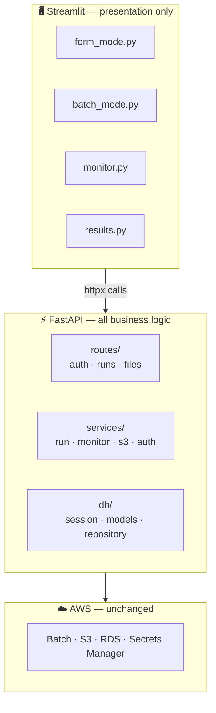

 
The original OmniDomain had Streamlit talking directly to PostgreSQL and AWS Batch. That was a deliberate choice. I wanted to focus on the pipeline infrastructure, not the UI framework. It worked.
 
But as OmniDomain grew from one pipeline to three, and from a personal project to something I'd want a team to maintain, the architecture needed a second pass. The problem isn't Streamlit — it's that business logic, database queries, and AWS calls were all mixed inside UI files. Untestable, fragile, and locked to one consumer.
 
This week I added FastAPI as an application layer between the UI and the infrastructure.
 

 
The Streamlit files changed minimally — `from core.db import create_run` became `httpx.post("/runs", ...)`. The visual interface is identical.
 
What changed is where logic lives. Routes handle HTTP concerns. Services handle business rules — validate the TSV, check S3 files exist, submit to Batch. A repository layer owns every SQL query in one place. Each layer has one reason to change.
 
The immediate benefit: services are plain Python now. Testable without running Streamlit or touching AWS.
 
The Terraform infrastructure is completely untouched.
 
