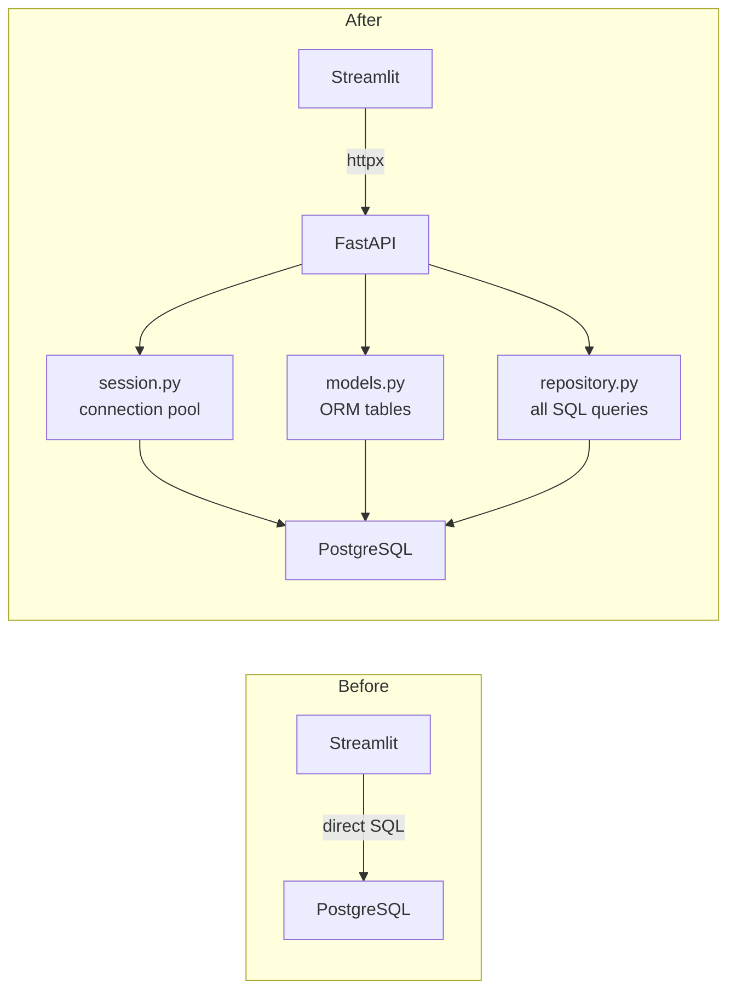
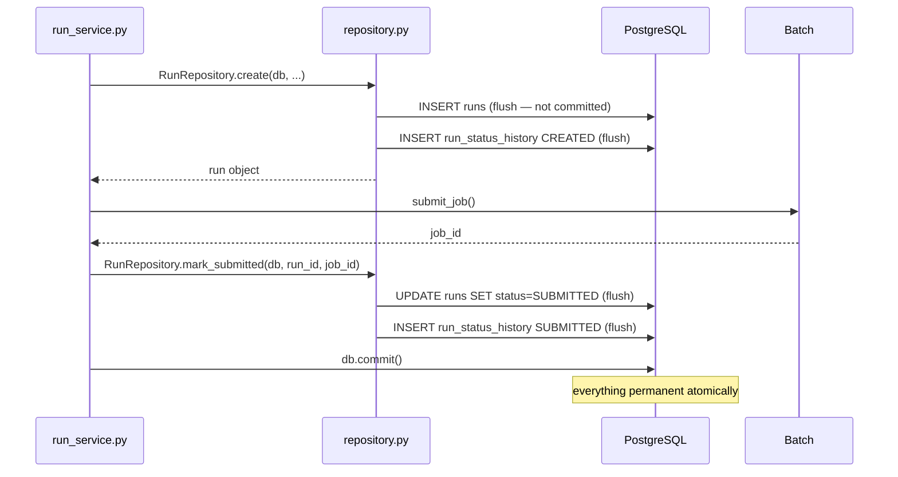

This week I built the database layer for OmniDomain's FastAPI backend. Three files, each with one job.

The original OmniDomain had Streamlit calling PostgreSQL directly — queries scattered across UI files, no transaction control, no audit trail. As I started asking what production-grade internal tooling actually requires, this was the first thing to fix.

---

**session.py — connection management**

Manages the PostgreSQL connection pool and session lifecycle. One engine, five persistent connections, pre-ping to detect stale connections. A generator-based `get_db()` function guarantees every session closes — even on exceptions — via FastAPI's dependency injection system.

The key decision: `get_db()` uses `yield` not `return`. The session is guaranteed to close in the `finally` block regardless of what happens in the caller. No leaked connections, no "too many clients" errors at 3am.

---

**models.py — SQLAlchemy 2.0 typed models**

Four tables: `users`, `runs`, `uploads`, `run_status_history`. Written in SQLAlchemy 2.0 syntax with full type hints — every column type is enforced at the Python level, not just the database level.

Two decisions worth explaining:

`RunStatus` is a Python enum backed by a Postgres enum type. Invalid status values are impossible by construction — a typo raises a Python error immediately, and Postgres enforces valid values even on direct SQL inserts.

`run_status_history` is append-only. Every status transition inserts a new row. Nothing is ever updated. This gives a complete audit trail for every job — created, submitted, running, completed or failed, with timestamps. In scientific contexts reproducibility matters. In regulated environments it's a requirement.

---

**repository.py — all SQL in one place**

Every database query in the codebase lives here. Nowhere else.

Three repository classes — `UserRepository`, `RunRepository`, `UploadRepository` — each owning the queries for their table. Static methods, no instance state, called directly: `RunRepository.get_by_user(db, user_id)`.

The transaction boundary is explicit: the repository flushes, never commits. The service layer owns the transaction. One business operation — create a run, submit to Batch, record the job ID — either succeeds completely or rolls back completely. The repository prepares the work, the service decides when it's done.

If Batch submission fails, `db.commit()` never runs. The transaction rolls back. No run record with a missing job ID.

---

**Migration**

Schema changes are managed by Alembic. The initial migration was autogenerated by diffing the models against an empty database — four tables, all indexes, the `run_status_enum` Postgres type, and cascade constraints. Applied locally against Docker Postgres, committed alongside the models.

Every future schema change gets a new migration file. No manual SQL, no schema drift between environments.

---

*Next: FastAPI routes and the service layer — where the repository gets called.*

*Full architecture writeup → [Medium post]*
*Code → [github.com/NaouelEldjouher/OmniDomain]*
